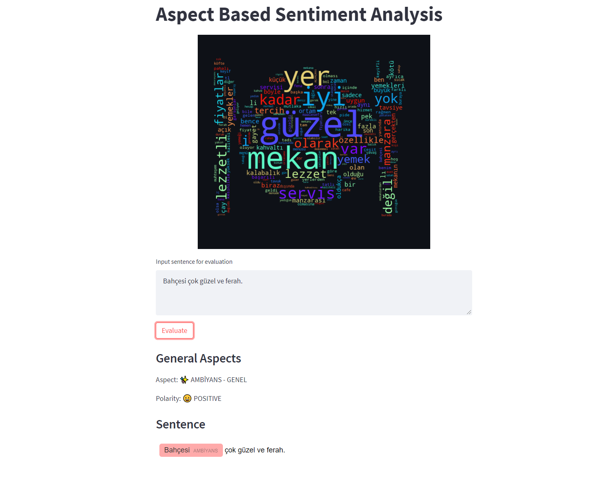

# ASPECT BASED SENTIMENT ANALYSIS

Aspect based sentiment analysis with Turkish restaurant review dataset using BERT model. 


## Table of Contents
* [About](#about)
* [Installation Steps](#installation-steps)
* [Usage Steps](#usage-steps)

## About
 
ABSA has three steps. First, find the aspects in the sentences. Second, find the classes of that aspects. Last, find the polarity of this sentence based on these aspects and classes. In this repository, all these three steps are implemented using the SemEval-2016 ABSA Restaurant Reviews-Turkish dataset. This dataset has 12 classes:

|                          	|                    	|                  	|
|--------------------------	|--------------------	|------------------	|
|     RESTAURANT#PRICES    	|  AMBIENCE#GENERAL  	| LOCATION#GENERAL 	|
|    RESTAURANT#GENERAL    	| FOOD#STYLE_OPTIONS 	|   FOOD#QUALITY   	|
| RESTAURANT#MISCELLANEOUS 	|   DRINKS#QUALITY   	|    FOOD#PRICES   	|
|   DRINKS#STYLE_OPTIONS   	|    DRINKS#PRICES   	|  SERVICE#GENERAL 	|

Since the ASPECT_EXTRACTION part is made last, it does not work with other parts.


## Installation Steps
- Clone the repository and get into project directory.
```bash
git clone https://github.com/EzgiArslan/aspect-based-sentiment-analysis.git

cd aspect-based-sentiment-analysis
```
- Download the train, test, validation data from [metashare](http://metashare.ilsp.gr:8080/). Store them in _input_files_. 
- Create a virtual environment with following command.
```bash
python -m venv venv-name
```
- Activate the environment.
```bash
venv-name\Scripts\activate
```
- For installing the required libraries run the following command.
```bash
pip install -r requirements-dev.txt
```


## Usage Steps

- Go to the main.py and change file name variables with your input file names.
- Run the main.py for train the models. If you have CUDA installation, it will be use for training. 
- UI is created with Streamlit. 



- You can use this with following command.
```bash
streamlit run app.py
```
- Try your sentences. 

